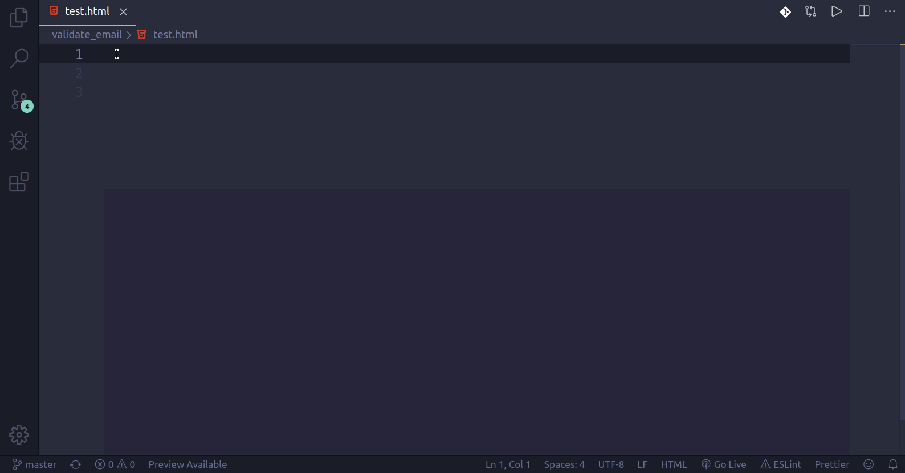

# django-template-snippets
 

A collection of built-in template tags and filters for django templates.

## Installation
Launch VS Code Quick Open (Ctrl+P), paste the following command, and press enter.
```
ext install StuartElimu.django-template-snippets
```

## Usage


### Template tags

blk 
```

```
There are a couple of options for different types of block e.g title, content.

---

com
```
|
```


csrf
```

```


ext
```

```
By default `base.html` is suggested but you can change the name of the file.

---

for 
```

    |

```


foremp 
```

    |

    |

```

if
```

    |


```
incl
```

```

ld
```

```

sta
```

```
url
```

```
wi
```

    |

```
{{
```
{{ | }}
```

{#
```
{# | #}
```

>>The `|` character shows the cursor positions where you can insert or change content.

>>All unknown abbreviations will be transformed to HTML tag, e.g. foo → `<foo></foo>`.

## Release Notes

### 0.0.1

Initial release of django-template-snippets.

### 0.2.0

Add more template tags, change syntax and update README.md with cheat sheet.


